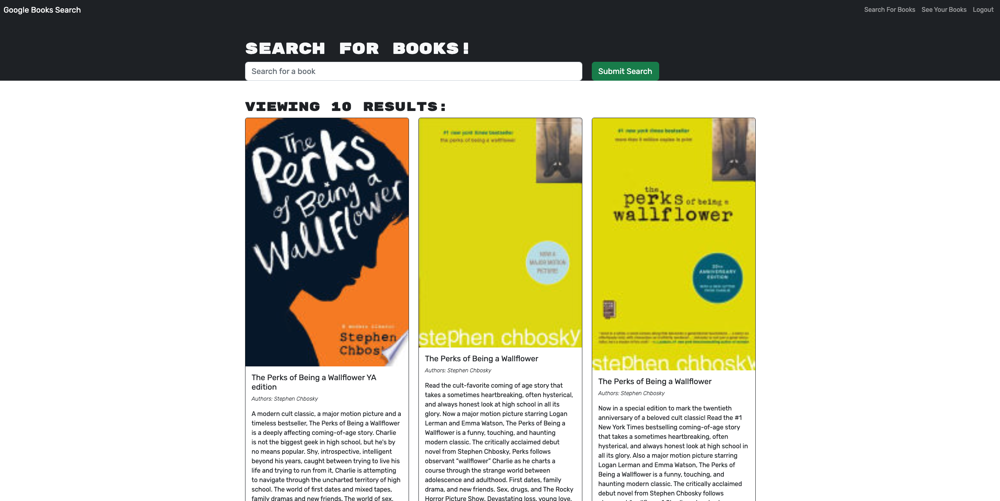

# Book Search Engine

## Description
This application uses the Google Books API to allow users to search and save for books.

This is a refactoring project from the University of Toronto coding bootcamp. Original code was refactored to use a GraphQL API, and built with an Apollo Server.

## Table of Contents
* [Installation](#installation)
* [Usage](#usage)
* [Credits](#credits)
* [License](#license)
* [Questions](#questions)

## Installation
If you are cloning and deploying the code locally, you will need access to nodeJS: ([download and read the documentation here](https://nodejs.org/en/download/)).

Once you have cloned the code, run:
`npm install`

The required dependencies and modules will be installed to your computer. To launch the application, run:
`npm run develop`

## Usage
You can access the deployed website [here!](https://obscure-plateau-06140.herokuapp.com/)

To access all the features, you must create an account with a username, email and password. 

You can search for any books in the search bar, and save any books you want to see later.

Your saved books will be under 'See Your Books'. You can also delete any previously saved books.

## Credits
This application was refactored as part of the University of Toronto bootcamp. Original starter code obtained from [here.](https://github.com/coding-boot-camp/solid-broccoli)

## License
  
This application is covered under the MIT license. To learn more, visit the link [here!](https://opensource.org/licenses/MIT)

## Questions
Questions? My Github is [here](https://github.com/phoenixouyang)
